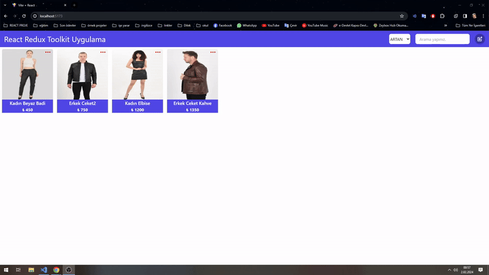

# 🚀 Product Selection Cards with React, Redux, and Tailwind CSS!

🛒 Project Features:
Product Addition: Users can easily add a variety of products to their cart.
Sorting: Products can be sorted based on their prices in ascending or descending order.
Deletion and Update: Easily remove or update products that are no longer needed.

🎨 Technologies Used:
React: Utilized to create a fast and dynamic user interface.
Redux: Chosen for efficient application state management, ensuring effective control over data.
Tailwind CSS: Employed for creating stylish and customizable designs.

React Redux Toolkit Store Projesi

Bu proje, React ve Redux Toolkit kullanarak geliştirilmiş bir alışveriş sepeti uygulamasını içermektedir. Bu uygulama, ürün eklemeyi, güncellemeyi ve silmeyi sağlayan temiz kod yapısı üzerine inşa edilmiştir. Ürün arama ve fiyat artan - azalan sıralama özelliği mevcuttur.

* Teknolojiler
* React
* Redux Toolkit
* React Router Dom
* React Icons
* Tailwind CSS
